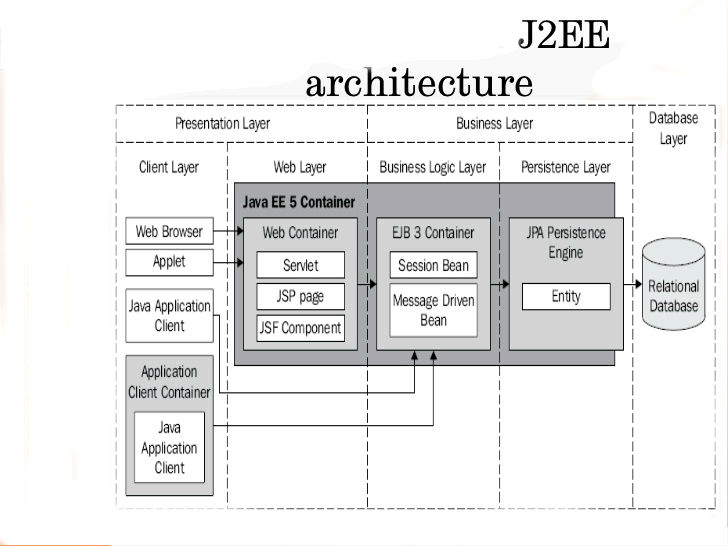

Complete JEE Tutorials
======================

##J2EE Architcture##

Web Container:
- The Web container is a runtime environment for JSP files and and servlets.

EJB Container:
- The EJB container is a runtime environment that controls the enterprise beans and provides
  them with important system-level services.

J2EE Server(Web Container + EBJ Container):
The J2EE server provides the following services:
- Naming and Directory: allows programs to locate services and components through the JNDI API.
- Authentication: enforces security by requiring users to log in.
- HTTP: enables Web browsers to access servlets and JavaServer Pages (JSP) files.
- EJB: allows clients to invoke methods on enterprise beans.

JEE servers:
- JBoss
- Glassfish
- TomEE (Tomcat is only the web container)

Download TomEE-1.7.4 from: <http://repo.maven.apache.org/maven2/org/apache/openejb/apache-tomee/1.7.4/apache-tomee-1.7.4-webprofile.tar.gz> 

Usage:
- Servlets can use JDBC,EJB,used for secure,transactional server-side processing or JNDI data source.

A Student Management System Use Case
------------------------------------

RootApplication (packaged as ear)
     + ServletModule (packaged as war)
     + EJBModule (packaged as jar)
     + JPAModule (packaged as jar)

[1] Configure JNDI data source
- To declare a JNDI DataSource for the MySQL database, create a Resource XML element as done in conf/context.xml.
  This file can be deployed as:
- Inside /META-INF directory of a web application: the JNDI DataSource is only available to the application itself,
  thus it cannot be shared among other ones. In addition, this makes the configuration dependent on the application.
- Inside $CATALINA_BASE/conf directory: this is the preferred place because the JNDI DataSource will be available to
  all web applications and it’s independent of any applications.

[2] Configure web.xml
- Create a resource-ref XML element in web.xml as done in conf/web.xml.
- This is necessary in order to make the JNDI DataSource available to the application under the specified namespace jdbc/UsersDB.

