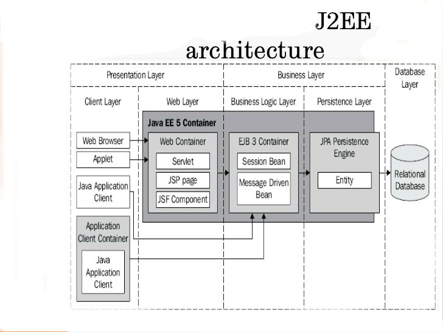

Complete JEE Tutorials
======================

##J2EE Architcture##

Web Container:
- The Web container is a runtime environment for JSP files and and servlets.

EJB Container:
- The EJB container is a runtime environment that controls the enterprise beans and provides
  them with important system-level services.

J2EE Server(Web Container + EBJ Container):
The J2EE server provides the following services:
- Naming and Directory: allows programs to locate services and components through the JNDI API.
- Authentication: enforces security by requiring users to log in.
- HTTP: enables Web browsers to access servlets and JavaServer Pages (JSP) files.
- EJB: allows clients to invoke methods on enterprise beans.

JEE servers:
- JBoss
- Glassfish
- TomEE (Tomcat is only the web container)

Download TomEE-1.7.4 from: <http://repo.maven.apache.org/maven2/org/apache/openejb/apache-tomee/1.7.4/apache-tomee-1.7.4-webprofile.tar.gz> 

